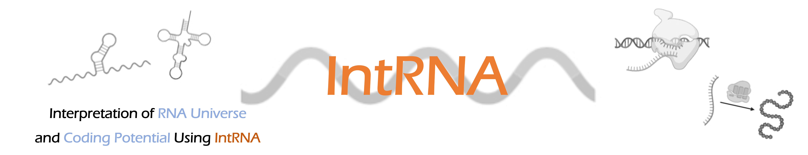

[]
[](https://www.python.org/)
[](http://idrblab.org/rnamap/)
RNAInterpret first introduced a dual-path classification model to enable a systematic interpretation of the RNA universe. **(1) providing a dual-path classification model was proposed to enable systematic interpretation of the RNA universe, (2) a novel encoding strategy was introduced by incorporating the most comprehensive set of features**. Therefore, users can get the encoding results and the classification of RNA from RNAInterpret.

# Contents
- [Contents](#contents)
- [Requirements and installment](#requirements-and-installment)
- [Basic usage](#basic-usage)
- [Study demo](#study-demo)
  - [RNAInterpret](#1-RNAInterpret)
- [Question && issue](#question--issue)

# Requirements and installment
This software is developed with Python 3.X, Python 3.X is required as runtime environment. we recommemd user to install [anaconda3](https://www.anaconda.com/) which is well-known as a scientific Python.

```shell
git clone https://github.com/idrblab/RNAInterpret
cd RNAInterpret
# virtual environment are recommended
conda create -n RNAInterpret python=3.8
pip install -r requirements.txt
```
# Basic usage
Users can use RNAInterpret to **(1) encode RNA image** and **(2) classification of RNA**.
```shell
python RNAInterpret.py --help
```
```
usage: RNAInterpret.py [-h] [-i INPUTFASTA] [-o OUTPUTPATH] [-m {1,2,3}]

Your program description here

optional arguments:
  -h, --help            show this help message and exit
  -i INPUTFASTA, --inputfasta INPUTFASTA
                        The RNA data needed to predict
  -o OUTPUTPATH, --outputpath OUTPUTPATH
                        The folder to save encoding features and predict result
  -m {1,2,3}, --model_type {1,2,3}
                        The model will be used to predict. 1: mRNA and ncRNA; 2: 13 classes linear ncRNA; 3: circRNA and linear RNA
```


# Study demo
## RNAInterpret
Users can run RNA-only tasks like following shell script.
```shell
python RNAInterpret.py -i ./demo/sense_intronic_sample.fa \
    -o ./demo/output_sense_intronic_sample \
    -m 1 
```

# Question && issue
If there are any usage problems, welcome to submit issues to this repository or contact author with email lfwyx@zju.edu.cn
